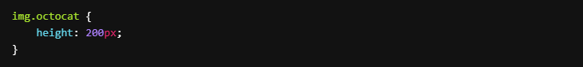

# GitHub Blocks

### Objectives

- Practice using the Box Model properties: `padding`, `border`, and `margin`.
- [https://www.w3schools.com/css/css_boxmodel.asp]
- Practice what we've learned about `Flexbox`
- Practice using different values of `justify-content`.

Use `margin` and `padding` to adjust the spaces between the rows and use `flexbox` properties to be able to put each image in its proper place. Set the images to all have a uniform size.

Pick your favorite colors and your favorite images from the Octodex to recreate the layout you see below.

- [https://octodex.github.com/]

<video controls src="20241030-2325-06.7839110.mp4" title="Title"></video>

- [x] Download 8 Octodex images

- [x] Use flex and CSS to recreate the above image

- [x] Upload the code and images to the platform

Here is how mine turned out. 

<video controls src="20241030-2328-03.6486391.mp4" title="Title"></video>

